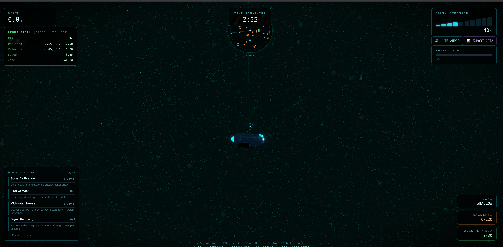

# Signal Diver 3D

Signal Diver 3D is an immersive underwater exploration and survival game. Take control of a specialized submarine, navigate through mysterious deep-sea environments, and recover lost data fragments while evading rogue drone swarms.



## 🌊 Game Features

- **Deep Sea Exploration**: Navigate through a procedurally generated seabed featuring kelp forests, debris fields, and anomaly zones.
- **Advanced Submarine Controls**: Intuitive 3D movement with mouse-look camera and realistic underwater physics.
- **Dynamic Environment**: Volumetric lighting, caustics, and post-processing effects create a truly atmospheric experience.
- **Interactive Missions**: Engage in complex hacking and alignment puzzles powered by a Phaser-integrated mini-game system.
- **Threat Management**: Avoid rogue drone swarms and manage your submarine's systems to survive the depths.
- **Rich State Management**: Powered by Zustand for seamless tracking of mission progress, telemetry, and world data.

## 🛠️ Tech Stack

- **Framework**: [React](https://reactjs.org/) + [Vite](https://vitejs.dev/)
- **3D Engine**: [Three.js](https://threejs.org/) via [React Three Fiber](https://docs.pmnd.rs/react-three-fiber/)
- **Mini-games**: [Phaser 3](https://phaser.io/)
- **State Management**: [Zustand](https://github.com/pmndrs/zustand)
- **Styling**: [Tailwind CSS](https://tailwindcss.com/)
- **Language**: [TypeScript](https://www.typescriptlang.org/)

## 🚀 Getting Started

### Prerequisites

- Node.js (v18 or higher)
- npm or yarn

### Installation

1. Clone the repository:
   ```bash
   git clone https://github.com/Justin21523/signal-diver-3d.git
   cd signal-diver-3d
   ```

2. Install dependencies:
   ```bash
   npm install
   ```

3. Start the development server:
   ```bash
   npm run dev
   ```

4. Build for production:
   ```bash
   npm run build
   ```

## 🕹️ Controls

- **WASD**: Movement (Relative to camera)
- **Space/Shift**: Ascend/Descend
- **Mouse**: Look around
- **E**: Interact with nodes
- **Q**: Toggle Sonar
- **F**: Toggle Flashlight

---

Created with passion for the deep sea exploration genre.
